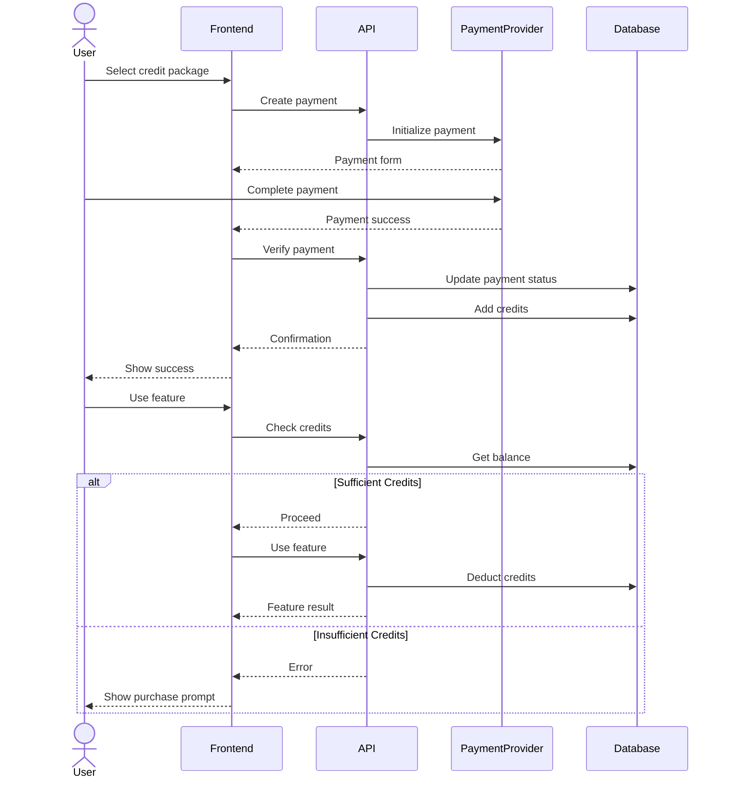

# Credit System Documentation

## Overview

The credit system manages user credits for various operations in the application. Credits are the primary currency for using features like image generation and model training.

## Database Models

### Payment Model
Records all payment transactions.

#### Fields:
- `_id`: ObjectId (Primary Key)
- `user_id`: String (Foreign Key → Users._id)
- `amount`: Float (Payment amount)
- `currency`: String (Payment currency code)
- `payment_method`: String (Payment method used)
- `status`: String ["pending", "completed", "failed", "refunded"]
- `credits_purchased`: Integer (Number of credits from this payment)
- `created_at`: DateTime (Payment timestamp)
- `transaction_id`: String (External payment processor transaction ID)

### CreditTransaction Model
Tracks credit usage and purchases.

#### Fields:
- `_id`: ObjectId (Primary Key)
- `user_id`: String (Foreign Key → Users._id)
- `run_id`: String (Foreign Key → InferenceRuns._id, Optional)
- `amount`: Integer (Positive for purchases, negative for usage)
- `transaction_type`: Enum ["purchase", "usage", "refund", "bonus", "expiry"]
- `description`: String (Transaction description)
- `created_at`: DateTime (Transaction timestamp)

## API Endpoints

### Credit Balance
```http
GET /api/credits/balance
```

Returns user's current credit balance.

Response:
```json
{
  "balance": 100
}
```

### Credit Transactions
```http
GET /api/credits/transactions
```

Parameters:
- `limit`: Integer (default: 50) - Number of transactions to return
- `skip`: Integer (default: 0) - Number of transactions to skip

Returns list of credit transactions.

Response:
```json
[
  {
    "id": "transaction_id",
    "user_id": "user_id",
    "run_id": "run_id",
    "amount": 100,
    "transaction_type": "purchase",
    "description": "Credits purchased",
    "created_at": "2024-03-20T12:00:00Z"
  }
]
```

### Payment History
```http
GET /api/credits/payments
```

Parameters:
- `limit`: Integer (default: 50) - Number of payments to return
- `skip`: Integer (default: 0) - Number of payments to skip

Returns list of payment transactions.

Response:
```json
[
  {
    "id": "payment_id",
    "user_id": "user_id",
    "amount": 10.00,
    "currency": "USD",
    "payment_method": "card",
    "status": "completed",
    "credits_purchased": 100,
    "created_at": "2024-03-20T12:00:00Z",
    "transaction_id": "external_transaction_id"
  }
]
```

### Verify Payment
```http
POST /api/credits/verify-payment
```

Request Body:
```json
{
  "payment_id": "payment_id"
}
```

Verifies a payment and adds credits to user's account.

Response:
```json
{
  "id": "payment_id",
  "user_id": "user_id",
  "amount": 10.00,
  "currency": "USD",
  "payment_method": "card",
  "status": "completed",
  "credits_purchased": 100,
  "created_at": "2024-03-20T12:00:00Z",
  "transaction_id": "external_transaction_id"
}
```

## Credit Operations

### Credit Deduction
Credits are deducted for:
1. Image generation (per request)
2. Model training (per training session)
3. Advanced features usage

### Credit Addition
Credits can be added through:
1. Purchases
2. Referral bonuses
3. Promotional credits
4. Refunds

## Database Indexes

### Payments Collection
```javascript
// User's payment history
{ "user_id": 1, "created_at": -1 }

// Transaction ID lookup
{ "transaction_id": 1 }, { unique: true }

// Payment status tracking
{ "status": 1, "created_at": -1 }
```

### CreditTransactions Collection
```javascript
// User's transaction history
{ "user_id": 1, "created_at": -1 }

// Run tracking
{ "run_id": 1 }

// Transaction type analysis
{ "transaction_type": 1, "created_at": -1 }

// Balance calculation
{ "user_id": 1, "transaction_type": 1, "created_at": -1 }
```

## Error Handling

### HTTP Status Codes
- 200: Successful operation
- 400: Invalid request
- 401: Unauthorized
- 402: Payment Required (Insufficient credits)
- 404: Resource not found
- 500: Internal server error

### Common Error Scenarios
1. Insufficient Credits
```json
{
  "detail": "Insufficient credits"
}
```

2. Payment Already Processed
```json
{
  "detail": "Payment already processed"
}
```

3. Payment Not Found
```json
{
  "detail": "Payment not found"
}
```

## Integration Flow



## Security Considerations

1. **Payment Verification**
   - Double-check payment status with payment provider
   - Prevent duplicate credit additions
   - Validate payment amounts and credit calculations

2. **Credit Operations**
   - Atomic transactions for credit updates
   - Proper locking mechanisms
   - Audit trail for all credit changes

3. **API Security**
   - Authentication required for all endpoints
   - Rate limiting
   - Input validation

## Monitoring and Analytics

Track the following metrics:
1. Credit purchase patterns
2. Credit usage patterns
3. Feature popularity by credit usage
4. User credit balance distribution
5. Payment success/failure rates 