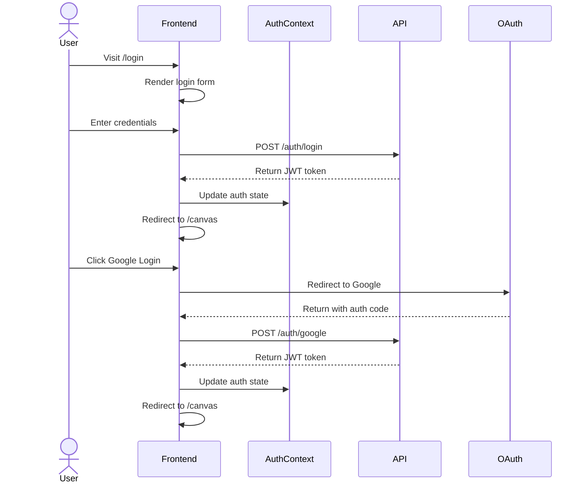
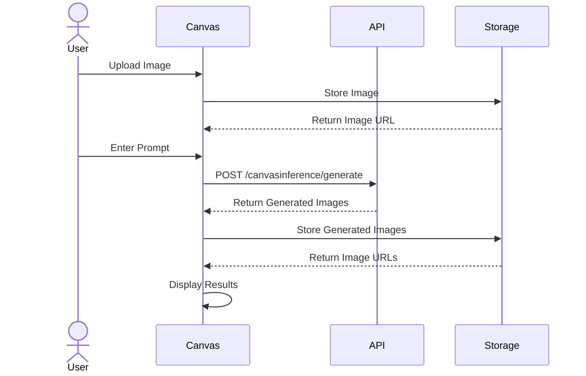
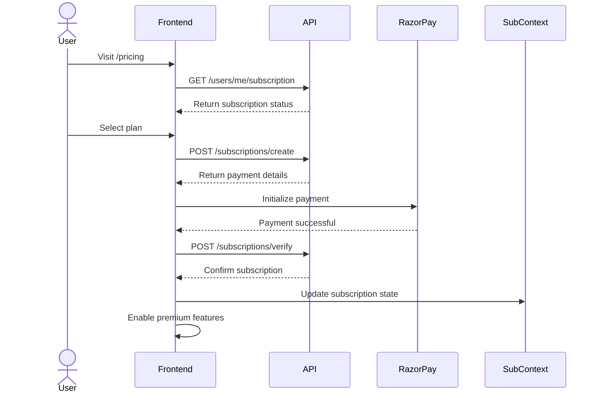
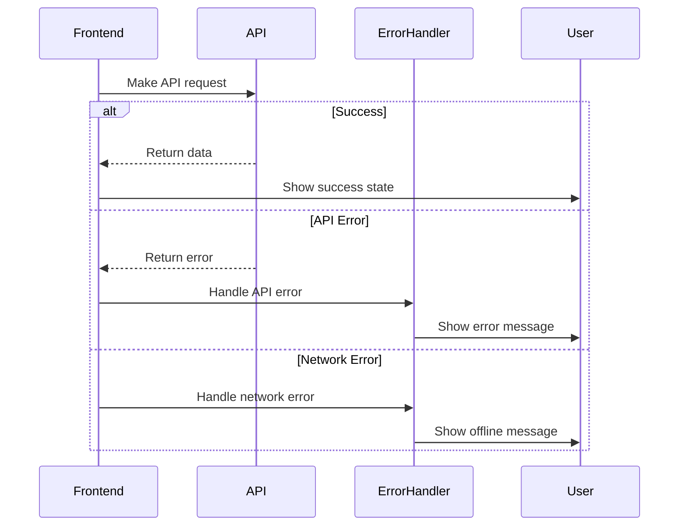

# Frontend Route Documentation

## Route Structure

The application uses Next.js 13+ App Router with the following main routes:

### Public Routes

#### Home Route
- **Path**: `/`
- **File**: `app/page.tsx`
- **Description**: Landing page with main features showcase
- **Components**: 
  - SplineScene (3D visualization)
  - ExamplesShowcase
  - PricingSection

#### Authentication Routes

##### Login
- **Path**: `/login`
- **Description**: User login page
- **Features**:
  - Email/Password login
  - Google OAuth login
  - Link to signup
- **Components**:
  - GoogleButton
  - LoadingSpinner

##### Signup
- **Path**: `/signup`
- **Description**: New user registration
- **Features**:
  - Email/Password registration
  - Google OAuth signup
  - Link to login

##### Auth
- **Path**: `/auth`
- **Description**: OAuth handling and callbacks
- **Features**:
  - OAuth provider callback handling
  - Authentication state management

### Protected Routes

#### Canvas Editor
- **Path**: `/canvas`
- **Description**: Main image generation workspace
- **Auth Required**: Yes
- **Features**:
  - Image upload
  - Prompt generation
  - Image editing
- **Components**:
  - ImageUploadInstructions
  - FileUploader
  - ImageViewer

#### Get Started
- **Path**: `/get-started`
- **Description**: Onboarding flow for new users
- **Auth Required**: Yes
- **Features**:
  - Tutorial steps
  - Initial setup guide

#### Pricing
- **Path**: `/pricing`
- **Description**: Subscription plans and pricing
- **Features**:
  - Plan comparison
  - Payment integration
- **Components**:
  - PricingSection
  - RazorpayButton

#### Prompt Examples
- **Path**: `/prompt_examples`
- **Description**: Gallery of example prompts and results
- **Features**:
  - Example showcase
  - FeedExamples display
- **Components**:
  - FeedExamples
  - ImageCard

## Layout Structure

### Root Layout
- **File**: `app/layout.tsx`
- **Purpose**: Global layout wrapper
- **Features**:
  - Meta tags
  - Global styles
  - Context providers

### Client Layout
- **File**: `app/ClientLayout.tsx`
- **Purpose**: Client-side layout wrapper
- **Features**:
  - Navigation
  - Authentication state
  - User interface elements

## Route Protection

Routes are protected using the following mechanisms:

1. **Authentication Check**:
   - Protected routes check for valid authentication token
   - Unauthenticated users are redirected to login

2. **Subscription Check**:
   - Certain features check for active subscription
   - Free users are prompted to upgrade when accessing premium features

## Route Transitions

1. **Authentication Flow**:
   ```
   Login/Signup → OAuth/Credentials → Home/Canvas
   ```

2. **Onboarding Flow**:
   ```
   Signup → Get Started → Canvas
   ```

3. **Subscription Flow**:
   ```
   Pricing → Payment → Canvas (with premium features)
   ```

## Sequence Diagrams

### Authentication Flow


### Canvas Generation Flow


### Subscription Flow


### Error Handling Flow


## Context and State Management

Routes have access to the following contexts:

1. **Authentication Context**:
   - User authentication state
   - Login/Logout methods
   - User profile data

2. **Subscription Context**:
   - Subscription status
   - Payment handling
   - Feature access control

## API Integration

Routes interact with backend APIs as documented in `API_DOCUMENTATION.md`:

- Authentication endpoints for login/signup
- User management for profile data
- Subscription management for payments
- Canvas inference for image generation

## Error Handling

Routes implement the following error handling:

1. **Authentication Errors**:
   - Invalid credentials
   - Expired sessions
   - OAuth failures

2. **Authorization Errors**:
   - Insufficient permissions
   - Subscription required

3. **API Errors**:
   - Network failures
   - Server errors
   - Rate limiting

## Loading States

Routes handle loading states using:

1. **LoadingSpinner Component**:
   - API calls
   - Page transitions
   - Resource loading

2. **Skeleton Loading**:
   - Content placeholders
   - Progressive loading

## Responsive Design

All routes are responsive and adapt to:
- Desktop views
- Tablet views
- Mobile views

Using Tailwind CSS breakpoints and responsive design patterns. 